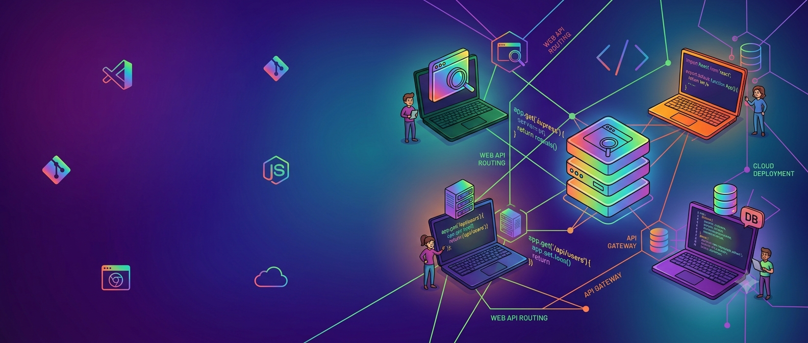

<!-- Banner: replace this src with your own uploaded banner (see guide) -->

  

<h3 align="center">Hi, I'm Fahim 👋</h3>

  

Full-Stack Engineer — React/Next.js · Node.js/Express · building end-to-end web systems

  
  
  

---

### 🧑‍💻 About Me
I'm a Computer Science & Engineering graduate from BRAC University (CGPA 3.73/4.00, 2026), based in Dhaka, Bangladesh. I build full-stack web applications end to end — from React/Next.js frontends to Node.js/Express APIs backed by PostgreSQL and Prisma — and I also work on applied AI/ML research on the side. I like owning a product from database schema to deployed UI.

### 🔭 Currently
- 🖥️ Building full-stack apps with Next.js, TypeScript, Prisma, and PostgreSQL (Programming Hero Level 2)
- 🧩 Shipped REST APIs like FixItNow and RentNest — auth, payments (Stripe), Swagger docs, deployed on Render
- 🎨 Built and deployed a personal portfolio with React, Three.js, and a Node/Express backend
- 🎓 Completed my undergraduate thesis, *"Computer Vision Based Deep Learning Approaches for Automated Visual Inspection and Defect Detection in Industrial Environments"* (EdgeNetV4)
- 🧠 Also researching multi-agent AI security — the confused deputy problem in MCP-based systems

### 🛠️ Skills

**Frontend Skills**

  

**Backend Skills**

  

**Technical Tools**

  

### 📊 GitHub Stats

  

---

<i>📍 Dhaka, Bangladesh &nbsp;|&nbsp; ✉️ arfanahmedfahim832@gmail.com</i>

